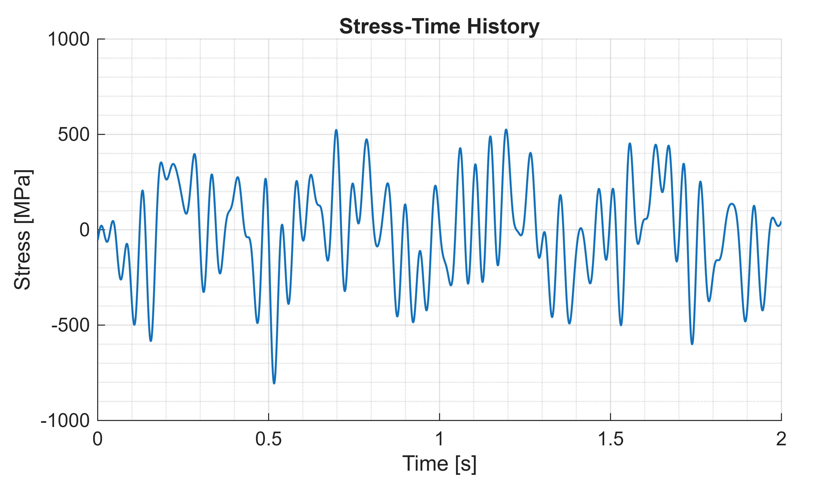
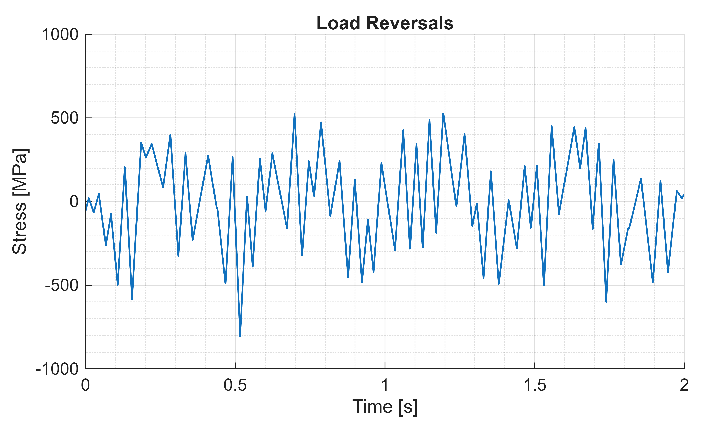
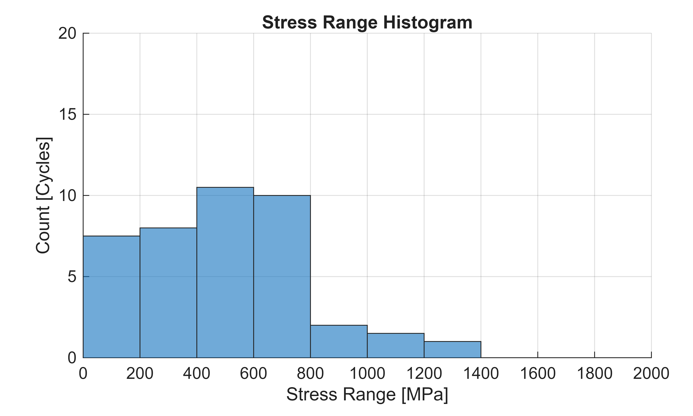
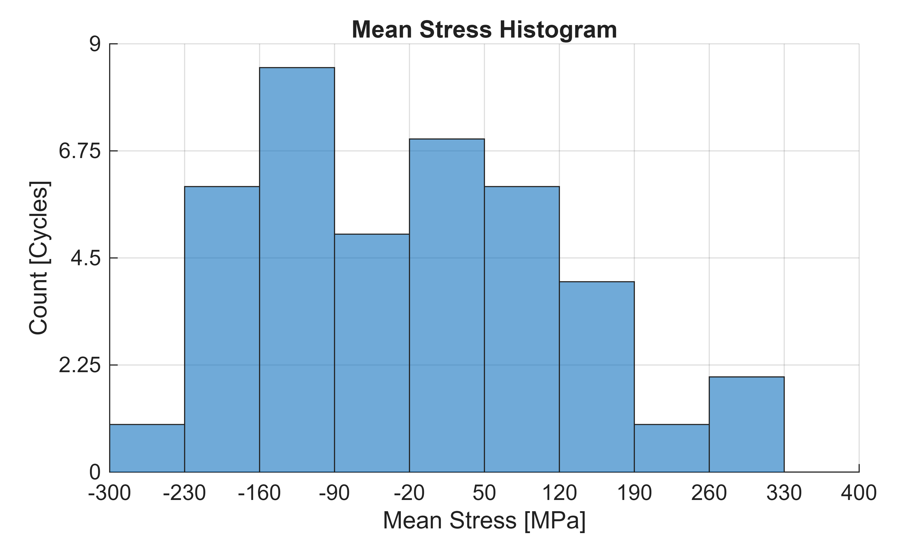
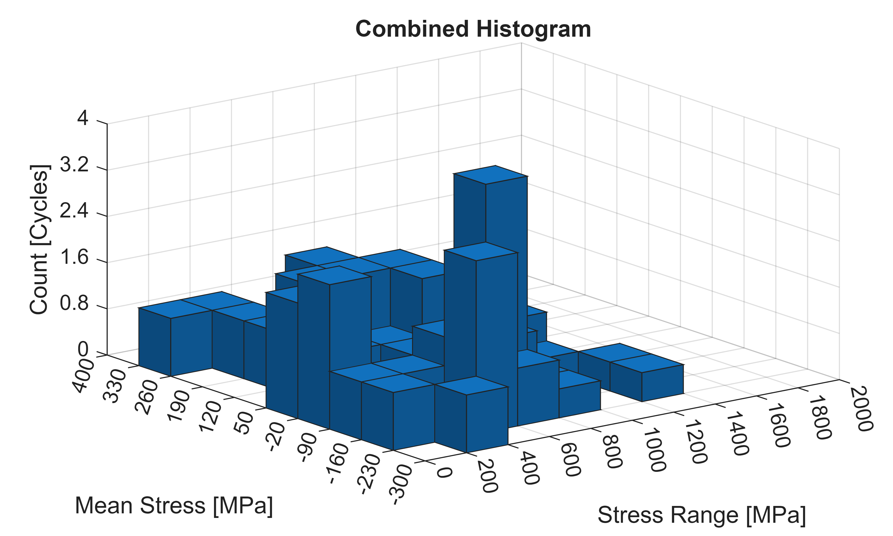
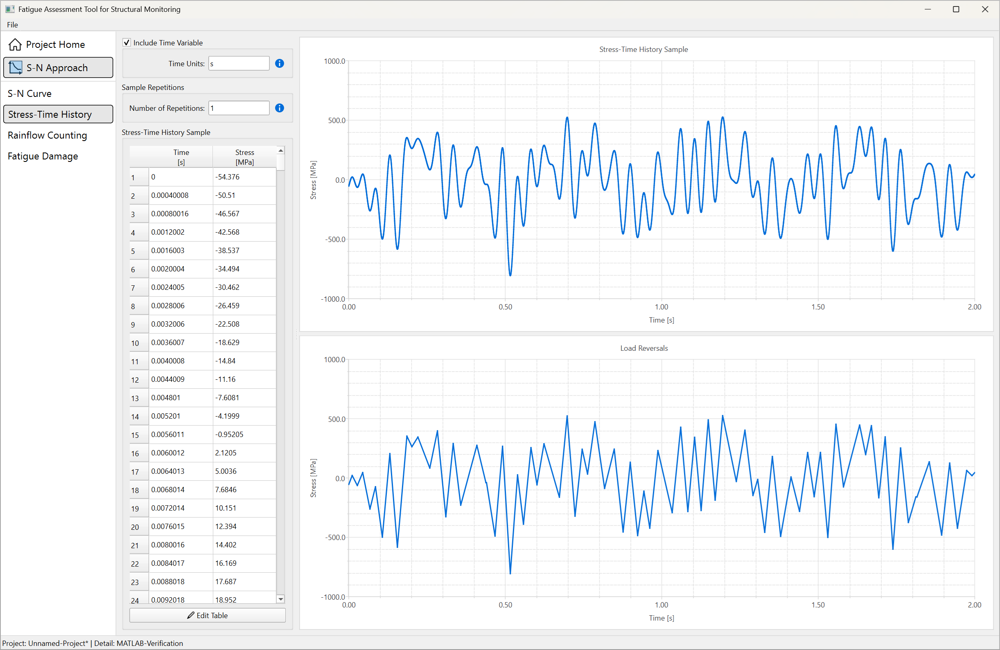
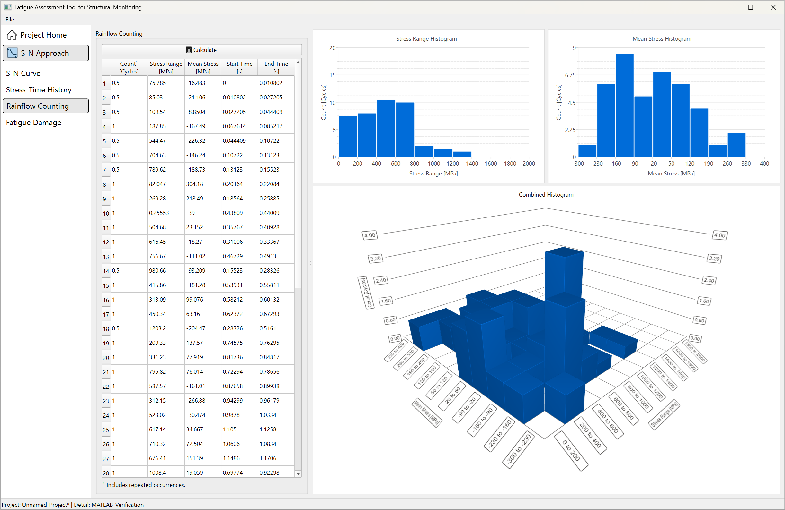

# Validation of the FAT\-SM rainflow cycle counting implementation against MATLAB

## Introduction

Both FAT\-SM and MATLAB implement rainflow cycle counting in accordance with ASTM E1049, *Standard Practices for Cycle Counting in Fatigue Analysis* ([doi:10.1520/E1049\-85R23](https://doi.org/10.1520/E1049-85R23)). This MATLAB Live Script generates a random sinusoidal stress\-time history, saves it to a file, and uses the same history to compare the two implementations.

**Note:** `rainflow` requires the Signal Processing Toolbox.

```matlab
% Reset workspace:
clear, clc, close all
```

## Stress\-time history generation

```matlab
% Generate stress-time history:
rng(2026, "twister");       % Fixed seed for reproducibility.
n = 10;                     % Number of random sinusoidal components.
t = linspace(0, 2, 5000);   % Sampled time, s.
f = 25*rand(n, 1);          % Component frequencies, Hz.
A = 200*rand(n, 1);         % Component amplitudes, MPa.
phi = 2*pi*rand(n, 1);      % Component phases, rad.
y = A.*sin(2*pi*f*t + phi); % Individual sinusoidal components, MPa.
y = sum(y, 1);              % Combined stress-time history, MPa.

% Save to file:
writematrix([t', y'], "history.csv");
```

## Results using MATLAB

```matlab
% Perform rainflow cycle counting:
[c, ~, ~, ~, idx] = rainflow(y, t);
```

### Stress\-time history plot

```matlab
figure, hold on, grid on, grid minor
plot(t, y, "LineWidth", 1)
title("Stress-Time History")
xlabel("Time [s]"), xlim([0, 2]), xticks(0:0.5:2)
ylabel("Stress [MPa]"), ylim([-1e3, 1e3]), yticks(-1e3:5e2:1e3)
set(gca, "Position", [0.12, 0.14, 0.84, 0.78])
```



### Load reversals plot

```matlab
figure, hold on, grid on, grid minor
plot(t(idx), y(idx), "LineWidth", 1)
title("Load Reversals")
xlabel("Time [s]"), xlim([0, 2]), xticks(0:0.5:2)
ylabel("Stress [MPa]"), ylim([-1e3, 1e3]), yticks(-1e3:5e2:1e3)
set(gca, "Position", [0.12, 0.14, 0.84, 0.78])
```



### Stress range histogram plot

```matlab
figure, hold on, grid on
edgesr = linspace(0, 2e3, 11);
idxr = discretize(c(:, 2), edgesr);
histogram("BinEdges", edgesr, "BinCounts", accumarray(idxr, c(:, 1), [10, 1]))
title("Stress Range Histogram")
xlabel("Stress Range [MPa]"), xlim([0, 2e3]), xticks(edgesr)
ylabel("Count [Cycles]"), ylim([0, 20]), yticks(0:5:20)
set(gca, "Position", [0.12, 0.14, 0.82, 0.78])
```



### Mean stress histogram plot

```matlab
figure, hold on, grid on
edgesm = linspace(-300, 400, 11);
idxm = discretize(c(:, 3), edgesm);
histogram("BinEdges", edgesm, "BinCounts", accumarray(idxm, c(:, 1), [10, 1]))
title("Mean Stress Histogram")
xlabel("Mean Stress [MPa]"), xlim([-300, 400]), xticks(edgesm)
ylabel("Count [Cycles]"), ylim([0, 9]), yticks(0:2.25:9)
set(gca, "Position", [0.12, 0.14, 0.82, 0.78])
```



### Combined histogram plot

```matlab
figure, view(3), hold on, grid on
histogram2("XBinEdges", edgesr, "YBinEdges", edgesm, ...
    "BinCounts", accumarray([idxr, idxm], c(:, 1), [10, 10]))
title("Combined Histogram")
xlabel("Stress Range [MPa]"), xlim([0, 2e3]), xticks(edgesr)
ylabel("Mean Stress [MPa]"), ylim([-300, 400]), yticks(edgesm)
zlabel("Count [Cycles]"), zlim([0, 4]), zticks(0:0.8:4)
set(gca, "Position", [0.12, 0.14, 0.82, 0.78])
```



### Rainflow table

```matlab
rf = array2table(c, "VariableNames", ...
    ["Count [Cycles]", "Stress Range [MPa]", "Mean Stress [MPa]", "Start Time [s]", "End Time [s]"])
```

| |Count [Cycles]|Stress Range [MPa]|Mean Stress [MPa]|Start Time [s]|End Time [s]|
|:--:|:--:|:--:|:--:|:--:|:--:|
|1|0.5000|75.7852|-16.4832|0|0.0108|
|2|0.5000|85.0301|-21.1056|0.0108|0.0272|
|3|0.5000|109.5405|-8.8504|0.0272|0.0444|
|4|1|187.8458|-167.4877|0.0676|0.0852|
|5|0.5000|544.4721|-226.3162|0.0444|0.1072|
|6|0.5000|704.6290|-146.2378|0.1072|0.1312|
|7|0.5000|789.6172|-188.7319|0.1312|0.1552|
|8|1|82.0470|304.1803|0.2016|0.2208|
|9|1|269.2846|218.4913|0.1856|0.2589|
|10|1|0.2555|-39.0001|0.4381|0.4401|
|11|1|504.6790|23.1523|0.3577|0.4093|
|12|1|616.4480|-18.2700|0.3101|0.3337|
|13|1|756.6702|-111.0182|0.4673|0.4913|
|14|0.5000|980.6629|-93.2090|0.1552|0.2833|
|15|1|415.8558|-181.2832|0.5393|0.5581|
|16|1|313.0872|99.0762|0.5821|0.6013|
|17|1|450.3435|63.1599|0.6237|0.6729|
|18|0.5000|1.2032e+03|-204.4694|0.2833|0.5161|
|19|1|209.3277|137.5685|0.7457|0.7630|
|20|1|331.2281|77.9189|0.8174|0.8482|
|21|1|795.8197|76.0142|0.7229|0.7866|
|22|1|587.5725|-161.0111|0.8766|0.8994|
|23|1|312.1477|-266.8838|0.9430|0.9618|
|24|1|523.0222|-30.4744|0.9878|1.0334|
|25|1|617.1445|34.6669|1.1050|1.1258|
|26|1|710.3159|72.5037|1.0606|1.0834|
|27|1|676.4094|151.3892|1.1486|1.1706|
|28|1|1.0084e+03|19.0588|0.6977|0.9230|
|29|1|432.5060|186.6760|1.2382|1.2659|
|30|1|135.3992|-79.8918|1.2915|1.3067|
|31|1|639.3200|-138.0284|1.3291|1.3535|
|32|1|289.7212|-136.4737|1.4131|1.4403|
|33|1|371.9334|28.4000|1.4663|1.4871|
|34|1|706.9633|-138.2054|1.3799|1.5071|
|35|1|244.0169|318.9944|1.6515|1.6699|
|36|1|520.9131|185.4664|1.5807|1.6323|
|37|1|513.2531|89.7588|1.6935|1.7139|
|38|1|953.5393|-24.1239|1.5307|1.5567|
|39|1|0.8881|-159.5459|1.8120|1.8156|
|40|1|511.2690|-119.3942|1.7880|1.8548|
|41|0.5000|1.3316e+03|-140.2364|0.5161|1.1946|
|42|0.5000|1.1259e+03|-37.3644|1.1946|1.7387|
|43|0.5000|852.8975|-173.8685|1.7387|1.7632|
|44|0.5000|733.4622|-114.1509|1.7632|1.8944|
|45|0.5000|606.7485|-177.5077|1.8944|1.9200|
|46|0.5000|548.9159|-148.5914|1.9200|1.9448|
|47|0.5000|486.6961|-179.7013|1.9448|1.9744|
|48|0.5000|44.3300|41.4817|1.9744|1.9912|
|49|0.5000|25.8346|32.2340|1.9912|2|

## Results using FAT\-SM

Results using FAT\-SM are obtained by loading the `"history.csv"` file generated above.

### Stress\-time history tab



### Rainflow counting tab



## Conclusions

MATLAB and FAT\-SM produce the same outputs.
